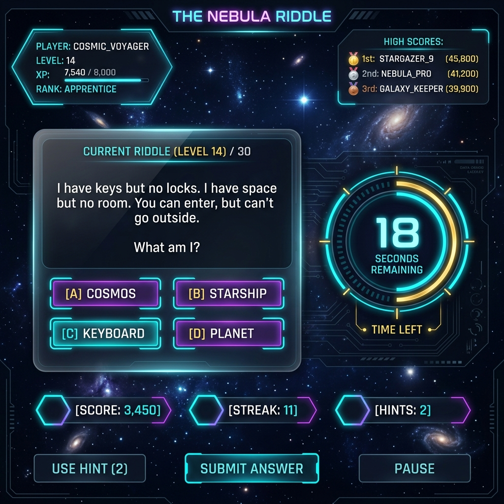
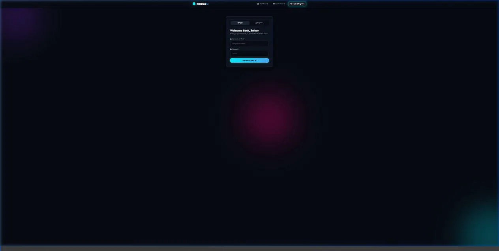
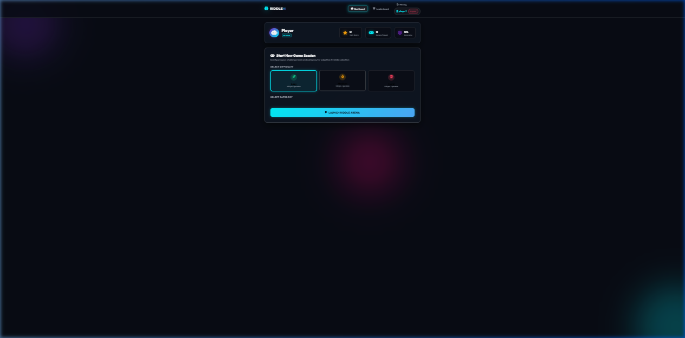

# AI Riddle Arena — Java Spring Boot Mini Project 🎮🧠

A complete, production-grade **AI Riddle Game** mini project built with **Java 17**, **Spring Boot 3**, **Spring Security (JWT)**, **Spring Data JPA/Hibernate**, **MySQL** (with automated **H2 Database** zero-config fallback), and a modern **Dark/Gradient Glassmorphic Gaming UI** frontend.

---

## 🎬 Walkthrough Demo & Screenshots

### 🎨 UI Dashboard Preview


### 📹 Interactive Gameplay Session Video Recording


### 📊 Live Dashboard Screenshot


---

## 🌟 Key Features

1. **User Authentication & Authorization**:
   - JWT-based authentication with BCrypt password hashing.
   - Role-based authorization (`ROLE_USER` and `ROLE_ADMIN`).
   - Registration, login, and token session persistence.

2. **Interactive AI Riddle Engine (`AIRiddleEngine`)**:
   - **Simulated AI Engine**: Evaluates answers using fuzzy keyword matching, alternate synonym arrays, option letter matching, and string distance thresholds.
   - **Adaptive Difficulty Scaling**: Automatically adjusts difficulty dynamically based on player's live accuracy streak.
   - **AI Hint Generator**: Generates clues or reveals letters with point penalty mechanics.
   - **Extensible Architecture**: Modular interface enabling zero-refactor plug-and-play integration for external LLMs (e.g. OpenAI API).

3. **Core Gameplay Dynamics**:
   - Selectable difficulty (Easy, Medium, Hard) and 6 categories (*Logic*, *Mathematics*, *Wordplay*, *Science*, *Technology*, *General Knowledge*).
   - Per-question **30-second circular countdown timer** with timeout handling.
   - Hint system (-50% score penalty per question).
   - Response-time speed bonus (+20% bonus for fast correct answers).

4. **Results & Analytics**:
   - Detailed performance rank badges (👑 *Riddle Grandmaster*, ⚡ *Master Logician*, 🧠 *Sharp Mind*, 🔍 *Keen Solver*, 🌱 *Novice Explorer*).
   - Per-question review breakdown table (answers, correct answers, hint usage, score breakdown).
   - Global Leaderboard ranking top players with medals (🥇 🥈 🥉).
   - Personal game history & performance meters.

5. **Admin Portal**:
   - Admin panel to add, edit, delete, and manage question bank and categories.

---

## 🏗️ Project Architecture & Tech Stack

```
ai-riddle-game/
├── pom.xml
├── README.md
├── mvnw / mvnw.cmd
├── docs/
│   └── images/      # Walkthrough screenshots & demo video
├── .mvn/
│   ├── wrapper/
│   └── apache-maven-3.9.6/
└── src/
    └── main/
        ├── java/com/riddle/airiddlegame/
        │   ├── AiRiddleGameApplication.java
        │   ├── ai/               # AIRiddleEngine & SimulatedAIRiddleEngine
        │   ├── config/           # SecurityConfig, CorsConfig, DataInitializer
        │   ├── controller/       # AuthController, GameController, RiddleController, etc.
        │   ├── dto/              # Request & Response DTOs
        │   ├── entity/           # User, Category, Riddle, Game, GameQuestion, Score
        │   ├── exception/        # GlobalExceptionHandler & Custom Exceptions
        │   ├── repository/       # JPA Repositories
        │   ├── security/         # JwtTokenProvider, JwtAuthenticationFilter, UserPrincipal
        │   └── service/          # AuthService, GameService, RiddleService, etc.
        └── resources/
            ├── application.properties
            └── static/
                ├── index.html
                ├── css/styles.css
                └── js/ (app.js, auth.js, game.js, admin.js)
```

---

## 🗄️ Database Schema & Entities

```
+----------------+      +-------------------+      +---------------------+
|     USERS      |      |     CATEGORIES    |      |       RIDDLES       |
+----------------+      +-------------------+      +---------------------+
| id (PK)        |<-----+ id (PK)           |<-----+ id (PK)             |
| username (UK)  |      | name (UK)         |      | question            |
| email (UK)     |      | description       |      | options_json        |
| password       |      +-------------------+      | correct_answer      |
| role           |                                 | alt_answers_json    |
| created_at     |                                 | hint                |
+-------+--------+                                 | difficulty          |
        |                                          | category_id (FK)    |
        |                                          | base_points         |
        |                                          +----------+----------+
        | 1                                                   | 1
        |                                                     |
        | N                                                   | N
+-------v--------+                                 +----------v----------+
|     GAMES      |1                               N|    GAME_QUESTIONS   |
+----------------+-------------------------------->+---------------------+
| id (PK)        |                                 | id (PK)             |
| user_id (FK)   |                                 | game_id (FK)        |
| difficulty     |                                 | riddle_id (FK)      |
| category_name  |                                 | user_answer         |
| status         |                                 | is_correct          |
| total_score    |                                 | hint_used           |
| accuracy       |                                 | points_awarded      |
| started_at     |                                 | response_time_sec   |
| finished_at    |                                 | question_order      |
+----------------+                                 +---------------------+
```

---

## 🌐 REST API Endpoints

| Method | Endpoint | Access | Description |
|---|---|---|---|
| `POST` | `/api/auth/register` | Public | Register new player or admin |
| `POST` | `/api/auth/login` | Public | Authenticate user & return JWT token |
| `GET` | `/api/auth/me` | Authenticated | Get current authenticated user details |
| `GET` | `/api/riddles/public` | Public | Fetch available riddles / categories |
| `GET` | `/api/riddles` | Authenticated | Query riddle question bank |
| `POST` | `/api/game/start` | Authenticated | Initialize game session |
| `GET` | `/api/game/{id}/question` | Authenticated | Get active question (masks correct answer) |
| `GET` | `/api/game/{id}/hint` | Authenticated | Request AI hint for active question |
| `POST` | `/api/game/{id}/answer` | Authenticated | Submit answer & calculate score |
| `GET` | `/api/game/{id}/result` | Authenticated | Fetch game final results & review |
| `GET` | `/api/leaderboard` | Public/Auth | Fetch global player rankings |
| `GET` | `/api/users/me/history` | Authenticated | Fetch user game session history |
| `POST` | `/api/admin/riddles` | Admin | Create new riddle in question bank |
| `PUT` | `/api/admin/riddles/{id}` | Admin | Update existing riddle |
| `DELETE` | `/api/admin/riddles/{id}`| Admin | Delete riddle |
| `POST` | `/api/admin/categories` | Admin | Create category |

---

## ⚡ Quick Start & Run Instructions

### Prerequisites
- **Java 17** or higher (`java -version`)
- **MySQL** (Optional: If MySQL is not running, the application automatically uses embedded **H2 Database** out-of-the-box!)

### Steps to Run

1. **Clone / Open Project**:
   ```bash
   cd f:\works\Java\ai-riddle-game
   ```

2. **Configure Database Credentials (Optional for MySQL)**:
   In `src/main/resources/application.properties` or environment variables:
   ```properties
   SPRING_DATASOURCE_URL=jdbc:mysql://localhost:3306/riddle_db?createDatabaseIfNotExist=true
   SPRING_DATASOURCE_USERNAME=root
   SPRING_DATASOURCE_PASSWORD=yourpassword
   ```

3. **Build & Compile**:
   ```bash
   .\mvnw.cmd clean compile
   ```

4. **Run Application**:
   ```bash
   .\mvnw.cmd spring-boot:run
   ```

5. **Access Application**:
   Open browser at: `http://localhost:8080`

---

## 🔑 Pre-Seeded Default Accounts

| Role | Username | Password | Email |
|---|---|---|---|
| **Admin** | `admin` | `admin123` | `admin@riddle.com` |
| **Player 1** | `player1` | `password123` | `player1@riddle.com` |
| **Player 2** | `riddlemaster` | `riddle123` | `master@riddle.com` |

---

## 🚀 Future Enhancements

- Integrate live OpenAI ChatGPT API key for real-time generative riddle creation.
- Add multiplayer 1v1 live riddle duel rooms with WebSockets.
- Add audio sound effects & voice hint narration.
