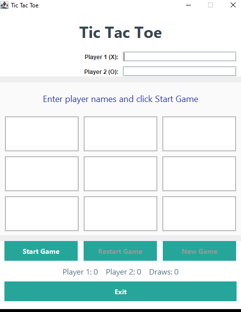

# Tic Tac Toe Java

A clean and beginner-friendly two-player Tic Tac Toe game built with Java Swing.

## Project Overview

This project demonstrates a simple desktop game using Java object-oriented design and Swing UI components.

## Folder Structure

- `Main.java` - application entry point.
- `Game.java` - game logic, turn management, and win/draw detection.
- `Player.java` - player data and symbol assignment.
- `Board.java` - board state, move validation, and board reset.
- `GameStatus.java` - game state enum: `PLAYING`, `PLAYER_WON`, `DRAW`.
- `ScoreBoard.java` - tracks player wins and draw count.
- `TicTacToeGUI.java` - Swing interface and event handling.
- `.gitignore` - excludes generated `.class` files.

## Features

- Welcome screen with player name inputs
- Clickable 3×3 board cells
- X/O turn switching
- Win detection for rows, columns, and diagonals
- Draw detection when the board is full
- Highlighting winning cells
- Restart game, new game, and exit confirmation
- Session scoreboard for wins and draws
- Input validation for empty names and invalid moves

## How to Run

From `f:\Java`:

```powershell
javac .\tictactoe\*.java
java -cp .\tictactoe Main
```

Preview:



## Notes

- This project uses Java Swing only and does not require a database.
- Designed for desktop use with a simple, modern interface.

Enjoy playing Tic Tac Toe! 🎮
