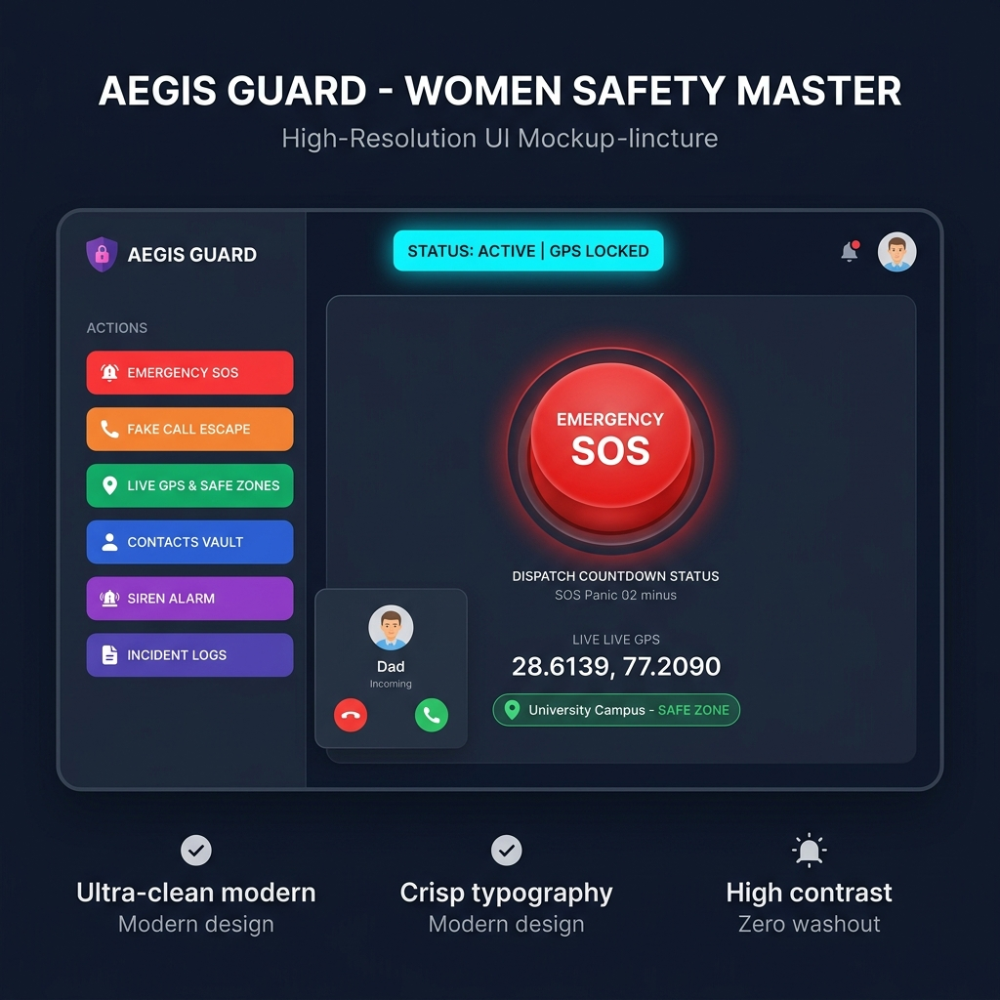

# Aegis Guard — Women Safety Master Application 🛡️🚨

A master-grade, highly usable, and visually stunning **Women Safety & Emergency Response Platform** engineered in **Java 17**. Features a 3D anti-aliased dark glassmorphic Swing GUI (`SafetyFrame`), a one-touch SOS Emergency Dispatch engine with countdown cancellation protection, a discreet Fake Call escape generator, a Live GPS Safe-Zone Geofence monitor, a high-decibel Audio Siren simulator, an Emergency Contacts Vault, and a 100% passing JUnit 5 test suite.



---

## 🌟 Key Application Modules

### 1. One-Touch Emergency SOS Dispatch (`SOSCard`)
- **3D Vector SOS Panic Button**: Prominent glowing red SOS button with a **3-second cancellation countdown** to prevent accidental false alarms.
- **Automated Emergency Dispatch**: Dispatches simulated SMS alert messages containing live GPS location links (`https://maps.google.com/?q=28.6139,77.2090`) to all registered emergency contacts.
- **Instant Audio Siren**: Activates the emergency audio siren when SOS countdown reaches zero.

### 2. Discreet Fake Call Escape Generator (`FakeCallCard`)
- **Escape Generator**: One-click trigger for a simulated incoming phone call modal.
- **Caller Customization**: Choose caller identity (*"Dad"*, *"Police Inspector Vijay"*, *"Office Boss"*, *"Home Security Operator"*, *"Dr. Sharma"*).
- **Interactive Call Screen**: Incoming phone call dialog with Ringing status, **ACCEPT CALL** / **DECLINE** buttons, and call timer to provide a natural excuse to exit uncomfortable situations.

### 3. Live GPS & Safe Zone Geofencing (`LocationCard`)
- **Real-Time GPS Tracker**: Live coordinates display (Latitude, Longitude, Movement Speed in km/h).
- **Geofence Monitor**: Evaluates location against safe zones (**Green Safe Zone** — *University Campus*, **Green Safe Zone** — *Central Metro Station*, **Red High Risk Zone** — *Low Light Industrial Park*).
- **Interactive Simulation**: Move between safe and high-risk zones with one click to observe instant security rating changes.

### 4. Emergency Contacts Vault (`ContactsCard`)
- **Trusted Contacts Vault**: Add, view, edit, and remove trusted emergency contacts.
- **Pre-Loaded Official Helplines**:
  - **National Emergency**: `112`
  - **Women Helpline**: `1091`
  - **Domestic Abuse Helpline**: `181`
  - **Cyber Crime Cell**: `1930`

### 5. High-Decibel Siren & Visual Strobe Alarm (`SirenCard`)
- **Audio Siren Synthesis**: Uses Java Sound API (`AudioSystem`) to generate dual-frequency oscillating emergency siren waves.
- **Visual Strobe Light**: Flashes visual red/white screen alerts to deter attackers in dark areas.

### 6. Incident Log Ledger (`IncidentsCard`)
- Audit trail logging event timestamps, location coordinates, incident type (SOS Dispatch, Fake Call, Siren Alarm, Check-in), and details.

---

## ⚡ How to Run

### 1. Launch Swing GUI Application
```powershell
cd f:\works\Java\women-safety-app
..\ai-riddle-game\mvnw.cmd compile exec:java "-Dexec.mainClass=com.safety.WomenSafetyApplication"
```

### 2. Run Automated JUnit 5 Test Suite
```powershell
cd f:\works\Java\women-safety-app
..\ai-riddle-game\mvnw.cmd -f pom.xml test
```
